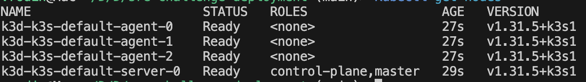

# sre-devops-challenge

This project is to practice creating and deploying different applications in kubernetes. It is for me to get more hands on experience with container orchestrations. I am following the instructions from.
https://pastebin.com/b7uUFMdj

For my kubernetes env I am setting up k3d with 3 "worker nodes". Previous I used minikube but that presented issues with certain deployments.

My first step is to deploy a rocket-chat. That requires a mongodb to be running as a replica set.

To create my cluster I use:
k3d cluster create -a 3
    This creates 3 agents that act as worker nodes.
    

To deploy rocket I need to deploy mongo db with the following parameters. From rocket chat docs. I don't want to use helm charts for this.

From: https://hub.docker.com/_/rocket.chat
$ docker run --name db -d mongo:4.0 --smallfiles --replSet rs0 --oplogSize 128
    Create a deployment with these specs
    I will be using mongo:6
    
$ docker exec -ti db mongo --eval "printjson(rs.initiate())"
    Create a job that execs into mongo and runs these commands.

What I learned:
    My StatefullSet had the wrong service name because of how I edited the name. With the correct service name I was able ping from each mongo container to the other using the dns 
    mongo-state-#.mongo-service.rocket-chat.svc.cluster.local

    I learned that i need to manually initialize mongo replicaset with 
        rs.initiate(
        {
            _id: "rs0",
            version: 1,
            members: [
                { _id: 0, host : "mongo-state-0.mongo-service.rocket-chat.svc.cluster.local:27017" },
                { _id: 1, host : "mongo-state-1.mongo-service.rocket-chat.svc.cluster.local:27017" },
                { _id: 2, host : "mongo-state-2.mongo-service.rocket-chat.svc.cluster.local:27017" }
            ]
        }
        )
    This part can be automated in a job after the containers are deployed.

    Rocket-chat url should always point to the "master" mongo (mongo-state-0)

The next step is to deploy github actions in k8s.
    Make a deployment file with their docker hub image.
    Find out what ports need to be open and if there are other dependencies.
    
